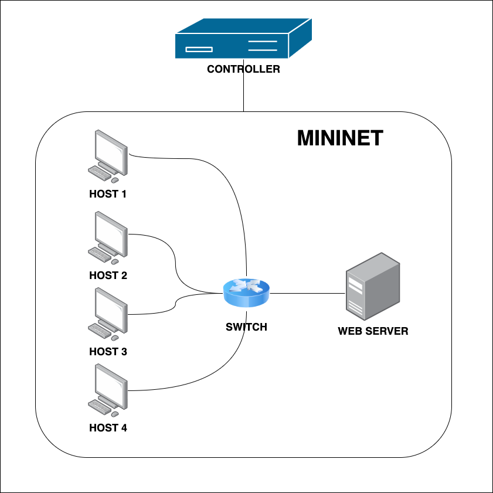
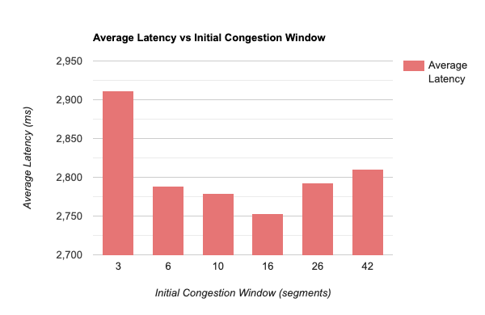
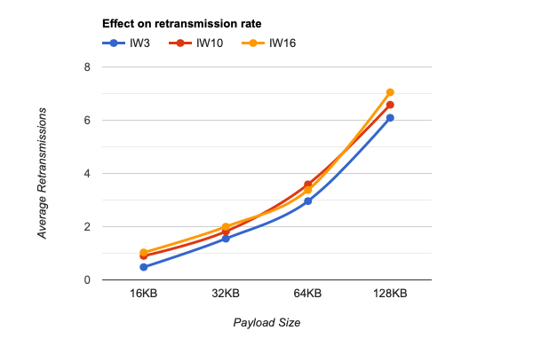

# Reproducing "An argument for increasing TCP’s initial congestion window"

## Team Members: Abhishek Arvind, Piyush Jaiswal, Prishita Kadam, Rahul Senguttuvan, Rashmi Phatak, Vibhu Sehra

## Introduction
To reduce Web latency during the slow start phase of a connection, the paper proposes increasing TCP's initial congestion window. TCP uses the slow start algorithm early in the connection lifetime to grow the amount of data that may be outstanding at a given time. In slow start the congestion window size increases based on the number of segments acknowledged. The size of the window increases until a packet loss occurs. The packet loss occurs due to router buffer overflow. After the packet loss occurs the connection exits a slow start to enter the congestion avoidance phase. Since the majority of connections in Web Search are short-lived and finish before exiting the slow start phase, TCP’s initial congestion window is a crucial parameter in determining flow completion time.

## Experiments

### Experimental Setup

All of our experiments were conducted on an AWS EC2 instance, on a Linux t2.large Virtual Machine running on Ubuntu Version 22.04. We emulated the experiments on a Mininet instance with Five Hosts and One Switch, with One considered as the server, and the other four clients as shown below

  

### Impact of Congestion Window size on Latency
In this experiment, we changed the initial congestion window size from 3 to 42 and the latency was measured. It was observed that the latency was considerably less for window size 10. It is observed that there is an improvement in latency for window size 16. Also, the latency increases for a window size of 42. This can be due to an increased level of packet losses.

  

### Impact of Congestion Window size on Latency in Lossless and Lossy networks

### Impact on subnets of varying BW, RTT and BDP

### Impact on subnets of varying the number of segments

## Limitations
The primary reason for an increase in latency is due to packet losses caused by overflowing bottleneck buffers. TCP flows are prolonged due to these losses as they add extra RTTs that are required to recover lost packets. This may also occasionally result in retransmission timeouts. The retransmission rate of TCP represents an upper bound for the percentage of packets lost as a result of congestion. We conducted an experiment to measure the impact of init_cwnd=10 on the retransmission rate. We calculated the average retransmission rate for initial congestion windows 3, 10, and 16 for payloads of different sizes. We found that as the value of the initial congestion window increases the average retransmission rate also increases. This is because the effective burst size transmitted is larger for a higher initial congestion window which in case results in an increased retransmission rate.

  

